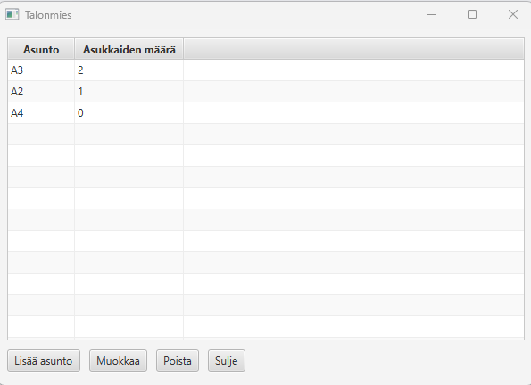
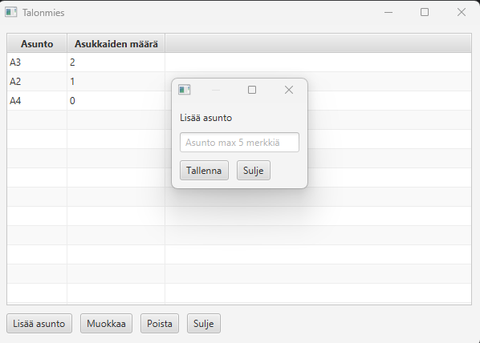
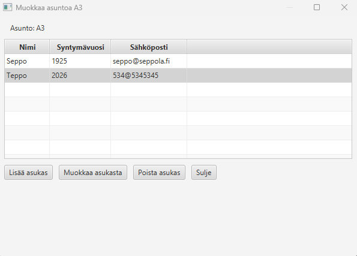
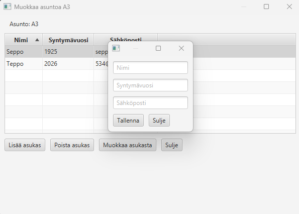
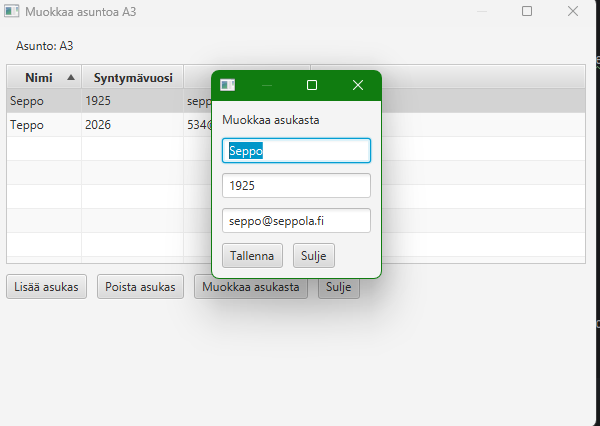
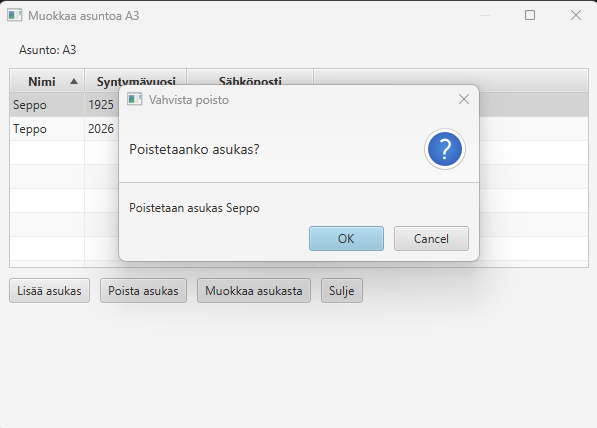
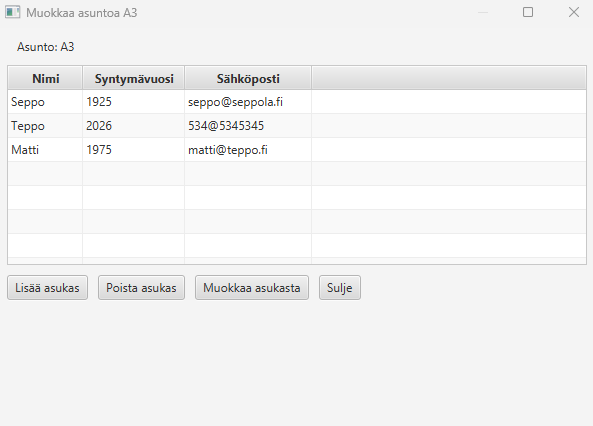

Ohjelmointi 2 lopputyö

Kyseessä on pieni sovellus, nimeltä Talonmies, jossa käyttäjä voi hieman hallinoida talonyhtiötä. Avatessaan ohjelman, käyttäjälle aukeaa seuraava ikkuna:

Käyttäjä voi lisätä uuden asunnon, muokata tai poistaa sen. Lisäksi on nappi ohjelman sulkemista varten.

Klikatessaan nappulaa "Lisää asunto" aukeaa seuraava näkymä: 

Näkymässä on syöttöruutu asunnolle ja nappulat tallentamiselle ja sulkemiselle.

Asunto voi olla max 5 merkkiä pitkä, samaa asuntoa ei voi lisätä kahdesti.

Tuplaklikatessa listattua asuntoa tai painamalla "Muokkaa" asunnon ollessa valittuna, aukeaa seuraava ikkuna: 

Tässä näkymässä voidaan lisätä asukkaita asuntoihin ja syöttää heidän tiedot, tässä tapauksessa nimi, syntymävuosi ja sähköposti.

Nimi voi sisältää vain kirjaimia, syntymävuosi vain numeroita ja sähköpostin on oltava vähintään 10 merkkiä ja max 20, sekä sen pitää sisältää @-merkin.

Muokkaa nappulassa päästään seuraavaan näkymään, joka sisältää asukkaan tiedot ja napit tallentamiseen ja sulkemiseen:

Jos Seposta taas halutaan päästä eroon, voidaan hänet kätevästi poistaa painamalla nappia, jolloin tulee varoitus, että oletko varma?

Seppo saa nyt jäädä ja Tepon lisäksi lisätty Matti.

