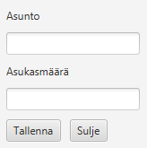

# Käyttöliittymäsuunnitelma

## Päänäkymä

### Mitä käyttäjä näkee
Lista asunnoista ja painikkeet.

### Mitä käyttäjä voi tehdä
Lisätä asunnon, muokata sitä ja poistaa asunnon.

### Komponentit
TableView ja Button

## Asunnon muokkausnäkymä

### Mitä käyttäjä näkee
Käyttäjä näkee asunnon tiedot ja nappulat lisäämiselle, poistamiselle ja näkymän sulkemiselle

### Mitä käyttäjä voi tehdä
Käyttäjä voi muokata asuntojen tietoja, lisätä tai poistaa asukkaita ja sulkea sivun/näkymän.

### Komponentit
TextField-kentät tietojen syöttämiseen sekä Button-painikkeet (lisää, poista ja sulje).

### Mitä käyttäjä näkee
Syöttöruutu asunnolle, asukasmäärälle ja nappulat tallentamiselle ja sulkemiselle

### Mitä käyttäjä voi tehdä
Lisätä uuden asunnon ja sulkea näkymän

### Komponentit
2 X TextField ja 2 X Button