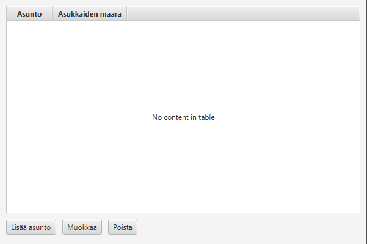
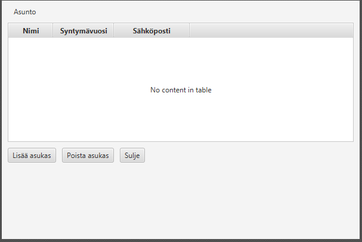

# Käyttöliittymäsuunnitelma

## Päänäkymä

### Mitä käyttäjä näkee
Lista asunnoista ja painikkeet.

### Mitä käyttäjä voi tehdä
Lisätä asunnon, muokata sitä ja poistaa asunnon.

### Komponentit
TableView ja Button

## Asunnon muokkausnäkymä

### Mitä käyttäjä näkee
Käyttäjä näkee kentät asunnon tiedoille (esim. osoite, pinta-ala tms.) sekä tallenna- ja peruuta-painikkeet.

### Mitä käyttäjä voi tehdä
Käyttäjä voi muokata asuntojen tietoja, lisätä tai poistaa asukkaita ja sulkea sivun/näkymän.

### Komponentit
TextField-kentät tietojen syöttämiseen sekä Button-painikkeet (lisää, poista ja sulje).